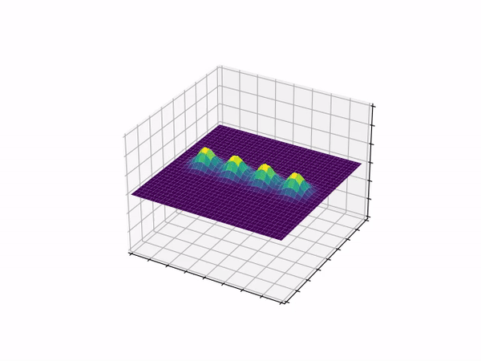

# Vorticity BVP PDE Solver

## About

Created by Gianluca Gisolo. This program creates a numerical solution and a video visualization to a partial differential equation system modeling the behaviors of vorticities in an environment with periodic boundary conditions.

The solver makes use of a Runga-Kutta 4,5 scheme to determine a solution. Currently the solver preforms entirely on the CPU with no GPU assistance in calculations or in the visulizations.

## Demos

To download higher quality versions of these demos check the `\animations\` folder and download the `.mp4` files.

Here you can see when the initial conditions are 4 vorticities all with the same radii and orientation along a line. This is the `.gif` version of the `demo.mp4`

Here you can see 4 vorticities whose placement on the grid, orientation, and radii have all been randomly generated by the script. This is the `.gif` version of the `random-demo.mp4`

## Setup

To the run the pogram, the following python packages must be installed:

- numpy
- scipy
- matplotlib

Furthermore, the animator, which saves the animation as a .mp4 file makes use of ffmpeg encoder, and so the program will not run if it's not properly installed. Go to the [ffmpeg website](https://ffmpeg.org/) and follow the posted instructions to download and install the ffmpeg encoder. Furthermore, don't forget to add it to your PATH.

One last thing, if the program is ran in a folder which does not contain a `.\animations\` folder it will not run (though the solution to this is to check if such a folder exists and create it if not).

## External

[Github](https://github.com/MasoMath)
